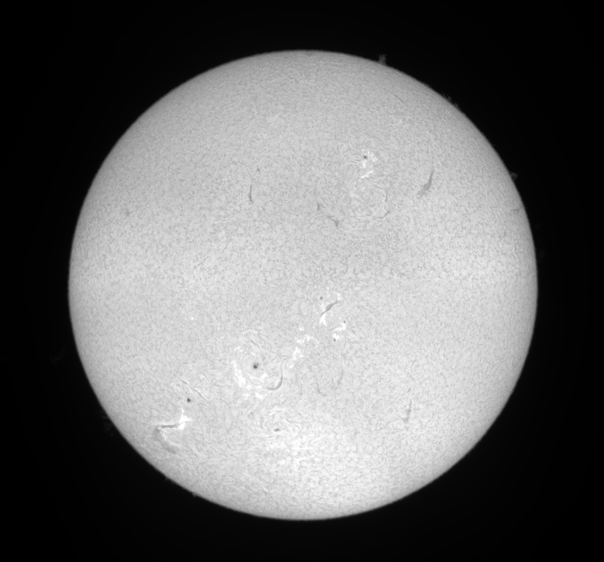
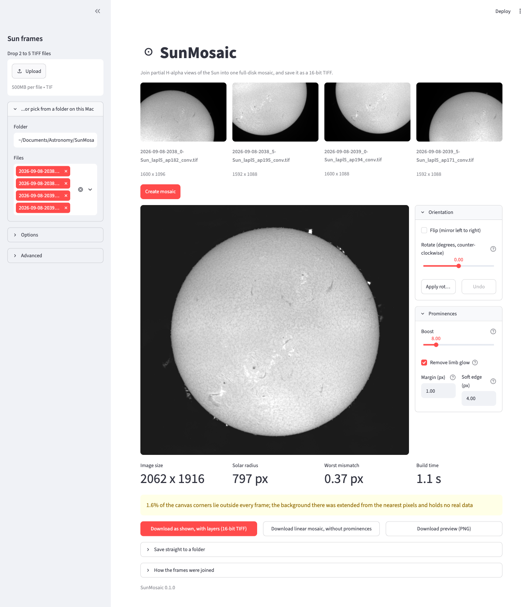

# SunMosaic

Join partial H-alpha views of the Sun into one full-disk mosaic, from a browser, and save the
result as a 16-bit TIFF.

At typical imaging scales the whole solar disk does not fit in one frame, so the Sun is captured
as several overlapping views, usually four quadrants. SunMosaic aligns them, matches their
brightness, and blends them into a single seamless disk.



## Install

Requires [uv](https://docs.astral.sh/uv/) and Python 3.12 or newer.

```
uv sync
```

## Try the demo

The `demo` folder holds four real H-alpha frames of the Sun, 2026-09-08 between 20:38 and
20:39. Each is a 16-bit AutoStakkert stack of about 1600 x 1090 px covering one quadrant of
the disk. Join them from the command line:

```
uv run sunmosaic build demo/*.tif -o demo_mosaic.tif --preview demo_mosaic.png
```

The result is a 2062 x 1916 px mosaic, the disk shown at the top of this page. In the browser
app, type the full path of the `demo` folder in the sidebar's folder box and press **Create
mosaic**.

## Run the browser interface

```
uv run sunmosaic-ui
```

The app opens at http://localhost:8501. Drop 2 to 5 TIFF files on the sidebar, or point the
folder box at a directory and tick the frames you want. Press **Create mosaic**, then
**Download mosaic (16-bit TIFF)** or save it straight to a folder.



## Build the Mac app

SunMosaic can be packaged as a standalone application for Apple Silicon Macs, delivered in a
disk image. The app carries its own Python and every dependency, so it runs without uv or a
terminal.

```
uv run python packaging/build_app.py
```

The build takes about a minute and writes two files to `dist/`:

| File | Size |
| --- | --- |
| `SunMosaic.app` | about 560 MB |
| `SunMosaic-0.1.0-arm64.dmg` | about 230 MB |

Open the disk image and drag SunMosaic onto the Applications shortcut beside it. The app opens
in its own window; closing the window, or quitting from the menu or the Dock, stops it.

- **Start-up** takes a few seconds while the image libraries load.
- **Downloads** open a save dialog. **Save straight to a folder** works as in the browser.
- **Logs** from the image server go to `~/Library/Logs/SunMosaic.log`. Look there first if the
  app does not start.
- **Browser instead of a window:** `open -a SunMosaic --args --browser`. From the project,
  `uv run --extra desktop sunmosaic-app` starts the same window without building anything.
- **Apple Silicon only.** The bundled libraries are arm64 builds.

The app is signed ad hoc, which is enough to run it on the Mac that built it. Copied to another
Mac, it is blocked the first time: open it once, then allow it under System Settings, Privacy &
Security, **Open Anyway**. Distributing it without that warning needs an Apple Developer ID and
notarization. Change `BUNDLE_ID` in `packaging/build_app.py` to a name of your own before
sharing it.

## Run from the command line

The `sunmosaic build` command does everything the browser app does, without a browser, so it
fits scripts and batch runs.

```
uv run sunmosaic build demo/*.tif -o mosaic.tif \
    --preview mosaic.png --report report.json
```

Give it 2 to 5 overlapping TIFF files in any order and an output path. Progress, the size of
what was written, the solar radius, the worst alignment mismatch and any warnings are printed to
standard error.

### Outputs

| Option | Writes |
| --- | --- |
| `-o, --output PATH` | the mosaic as a 16-bit linear TIFF, with the run's parameters in its metadata (required) |
| `--preview PATH` | an 8-bit stretched PNG, long side at most 1600 px, for a quick look |
| `--report PATH` | the same metadata as JSON: frame positions, gains, pair matches, Sun centre and radius, warnings |
| `--quiet` | nothing extra; suppresses the progress and summary lines |

### Building the mosaic

| Option | Default | Meaning |
| --- | --- | --- |
| `--blend multiband \| feather \| hard` | `multiband` | how frames are joined; `hard` shows the raw seams, which is how you judge the match |
| `--equalize off \| gain \| gain+offset \| linear \| quadratic` | `linear` | brightness matching between frames; `linear` and `quadratic` also correct the illumination across each frame |
| `--interp cubic \| lanczos \| linear \| integer` | `cubic` | sub-pixel placement; `integer` does not resample at all |
| `--no-rotation` | off | skip the rotation check between frames |

### Finishing

All finishing steps are off by default, and leaving them off writes the mosaic exactly as built.

| Option | Default | Meaning |
| --- | --- | --- |
| `--flip` | off | mirror left to right, applied before `--rotate` |
| `--rotate DEG` | `0` | turn counter-clockwise about the solar centre, -180 to 180 |
| `--square` | off | pad to a square with the Sun in the middle and fill the exposed corners |
| `--prominence-boost X` | `1` (off) | brighten everything outside the disk by X, 1 or more; also writes `<output>_prominences.tif`, a layered TIFF |
| `--prominence-border PX` | `1` | protected margin beyond the measured limb |
| `--prominence-feather PX` | `4` | soft edge outside the protected margin |
| `--keep-glow` | off | boost without removing the limb glow first, which leaves a bright ring |

### Examples

Check the seams with a hard join and no brightness matching:

```
uv run sunmosaic build demo/*.tif -o seams.tif --blend hard --equalize off --preview seams.png
```

Turn the disk 30° counter-clockwise, mirrored, on a square canvas, with prominences boosted ten
times:

```
uv run sunmosaic build demo/*.tif -o sun.tif --flip --rotate 30 --square --prominence-boost 10
```

This writes `sun.tif`, linear, and `sun_prominences.tif`, which holds the layers.

Exit status is 0 on success. It is 2 when the frames cannot be joined, for example when they do
not overlap, or when an option is out of range. The reason is printed to standard error.
Run `uv run sunmosaic build --help` for the option list.

## Finishing: orientation and prominences

Two optional steps work on the finished mosaic. Leaving their controls alone saves exactly the
mosaic as built.

**Orientation.** In the panel beside the preview, **Flip** mirrors the image left to right, the
way a star diagonal does, and the **Rotate** slider turns the disk about its measured centre
from -180 to 180 degrees. The preview follows both as you move them. **Apply rotation and make
square** then turns the full-resolution image, pads it to a square with the Sun in the middle,
and fills the exposed corners so the sky stays continuous. Applying again adds to what is
already applied, but the image is always resampled once from the built mosaic, never turned
twice. Quarter turns copy pixels without resampling. **Undo** returns to the built mosaic.

The square is as wide as the mosaic's longer side. With the Sun centred, a few rows at the far
edge of the canvas can fall outside it; on the sample frames that is sky more than 1000 px from
the Sun centre.

**Prominences.** The **Boost** slider brightens a copy of the image and shows it only outside
the disk. The disk itself, plus a 1 px margin beyond the measured limb, always comes from the
original, so no part of it is cut; a 4 px soft edge outside that margin joins the two.

Light scattered just outside the limb turns into a bright ring and broad arcs under a plain
boost. **Remove limb glow**, on by default, measures that glow in 15° sectors, ring by ring from
the real limb edge, and subtracts it before boosting. A prominence is much narrower than a
sector, so it survives, and the sky around the disk comes out flat. Untick it for a plain
multiply.

With a boost set, **Download as shown, with layers** saves the boosted result and **Download
linear mosaic, without prominences** saves the untouched data. **Save straight to a folder**
writes both, the second with a `_prominences` suffix.

The boosted file keeps its layers for further editing:

| Layer | Content |
| --- | --- |
| Sun disk, linear mosaic (top) | the untouched mosaic, with a layer mask that shows the disk plus the 1 px border |
| Prominences, boost xN (bottom) | the brightened copy, glow removed if that box was ticked |

The layers use the layered TIFF form that Adobe defined, which is the only one TIFF has.
Affinity Photo and Krita open it as layers as well as Photoshop. Programs without layer support,
such as PixInsight, ignore the layers and open the flat image stored in front of them, which is
exactly what the two layers look like together. Within the 4 px soft edge the mask lets slightly
more of the brightened copy through wherever the limb is dimmer than the brightened sky, so the
joint never shows a dark ring. The flat image is non-linear and says so in its metadata, so it is
never mistaken for measurements.

## How it works

1. **Find the limb.** Each frame is thresholded, and a circle is fitted to the arc of solar limb
   it contains. Making those fitted centres coincide places the frames to about a pixel, without
   needing any frame-to-frame image match.
2. **Refine each pair.** For every pair of frames, the predicted overlap is cropped from both and
   phase-correlated. This is what makes thin overlaps work: a 25 % overlap defeats whole-frame
   correlation, but succeeds easily once the search is restricted to the right region.
3. **Solve all positions together.** Every pair measurement feeds one weighted least-squares
   solve. Because the frames form a loop, the leftover disagreement is a real consistency check,
   and a large one is reported as possible rotation between frames.
4. **Match brightness.** The etalon's sweet spot makes each frame brighter in the middle than at
   its edges, so a single number per frame cannot describe it. A gentle polynomial is fitted per
   frame from the overlap ratios instead, held in check by a prior that keeps it from inventing
   structure the overlaps do not show. On the sample frames this cuts the step across the seams
   by a fifth before any blending happens.
5. **Blend.** Each pixel is assigned to the frame it sits deepest inside, so seams run down the
   middle of the overlaps. A Laplacian pyramid blends the coarse scales only, which hides the
   residual etalon gradient while every fine detail still comes from a single frame.

A frame with no limb at all, such as a fifth view of the disk centre, is located by matching it
as a template against the mosaic built so far, which places it to well under a pixel.

If the frames turn out not to be related by a pure shift, which is what field rotation on an
alt-azimuth mount does, the angle between each pair is measured, the frames are turned into a
common orientation, and the placement is redone. This is reported when it happens and you can
switch it off. It matters most in the case where rotation has grown large enough that the frames
stop matching at all: correlation gives up there, but the angle is still measurable, so a set
that would otherwise fail still assembles.

## Notes on the output

The saved TIFF is 16-bit and linear. No stretch is applied, so it is ready for ImPPG,
PixInsight or Affinity Photo. The preview in the browser is stretched for display only.

Four frames arranged in a square cover a cross-shaped area, so the corners of the bounding box
fall outside every frame. Those corners are filled from the nearest real pixels to keep the sky
continuous, the amount is reported as a warning, and the region holds no real data. The solar
disk itself is never allowed to fall on filled canvas.

Every run embeds its parameters in the TIFF's `ImageDescription` as JSON: source file names,
frame positions, gains, offsets, the fitted solar centre and radius, and any warnings.

## Tests

```
uv run pytest
```

The suite covers synthetic frames with known offsets and gains, and regression values measured
from the real sample frames. Tests that need the sample frames are skipped when they are absent;
point `SUNMOSAIC_SAMPLES` at the folder holding them to run those elsewhere.

## Reference

`plan.md` holds the full design: the measured properties of the input, the algorithms and their
parameters, the verification plan, and the risks considered.
